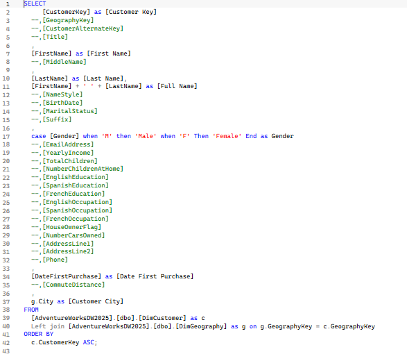
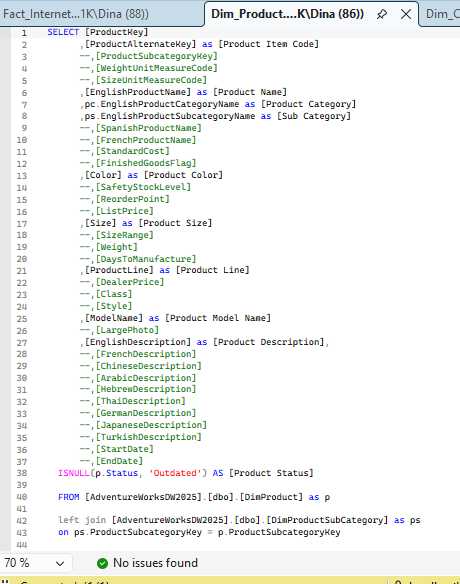
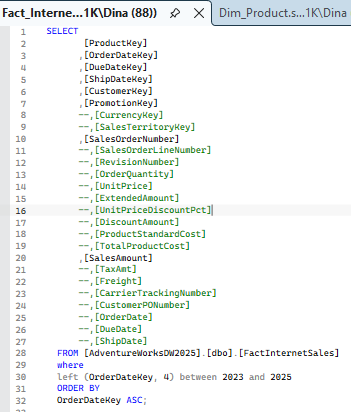
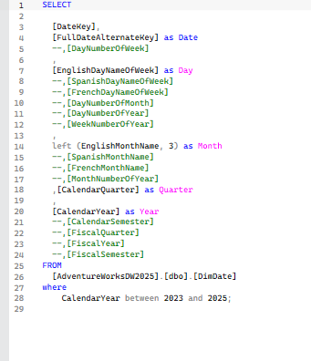
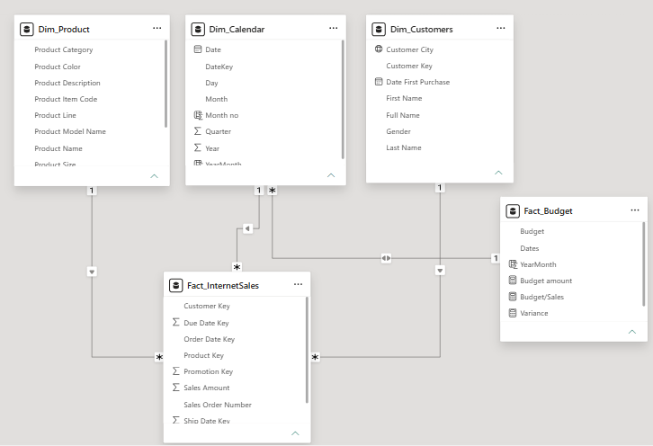
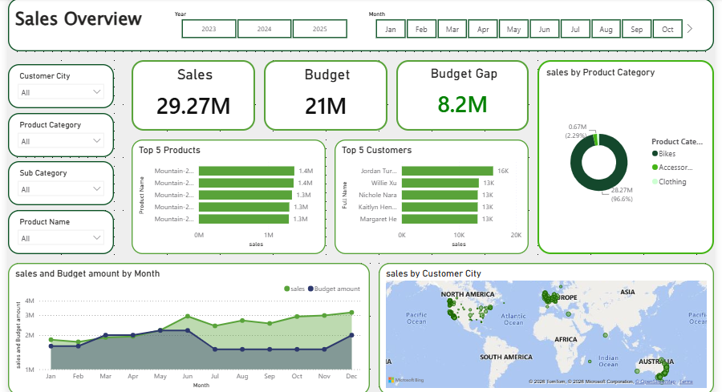

# Sales Performance Overview and Trend Breakdown

## Sales Performance Analysis

### Company Background

This project analyzes internet sales transaction data to evaluate business performance, identify revenue drivers, understand customer purchasing behavior, and uncover product trends.

The dataset consists of sales transactions, customer information, product details, and calendar data. SQL was used for data cleaning and transformation, while Power BI was used for data modeling and dashboard development.

The project focuses on the following areas:

1. Sales Performance – Revenue trends, order volume, and average order value (AOV)
2. Product Performance – Best selling products and categories
3. Customer Analysis – Purchasing behavior and customer demographics
4. Geographic Analysis – Revenue contribution across customer locations

---

# Tools Used

* SQL
* Power BI
* Excel
  
---

# Project Files

**View Power BI Files** [View Files](Files)

**View Dataset Files** [View Files](Files)

### Dashboard

* [Power BI File](SALES.pbix)

### Data

* Fact_InternetSales.csv
* Dim_Product.csv
* Dim_Customers.csv
* Dim_Calendar.csv

### SQL Scripts

* customer_cleaning.sql
* product_cleaning.sql
* sales_cleaning.sql
* calendar_cleaning.sql

This project demonstrates end-to-end business intelligence skills including SQL data preparation, data modeling, dashboard development, business analysis, and stakeholder-focused reporting.

---

# Data Preparation

## SQL Data Cleaning

The raw datasets were cleaned and transformed using SQL before being loaded into Power BI.

### Customer Data Cleaning

Key tasks performed:

* Standardized customer information
* Removed unnecessary columns
* Checked for missing values
* Prepared customer dimension table

### Product Data Cleaning

Key tasks performed:

* Organized product hierarchy
* Standardized category information
* Prepared product dimension table

### Sales Data Cleaning

Key tasks performed:

* Cleaned transaction records
* Validated sales amounts
* Prepared fact sales table

### Calendar Data Cleaning

Key tasks performed:

* Created date hierarchy
* Generated month and year fields
* Prepared calendar dimension table

---

# Data Model

The cleaned tables were connected using a star schema model inside Power BI.

The model consists of:

* Fact_InternetSales
* Dim_Customers
* Dim_Product
* Dim_Calendar

This structure enables efficient analysis across customers, products, and time periods.

---

# Dashboard

## Sales Performance Dashboard

The dashboard provides an interactive overview of:

* Revenue performance
* Order trends
* Product performance
* Customer demographics
* Geographic distribution

---

# Executive Summary

## Overview of Findings

The dataset contains approximately **58,000 sales transactions** between **2023 and 2025**, generating total revenue of approximately **$29.27M**.

Key performance metrics:

* Total Revenue: **$29.27M**
* Total Orders: **26,774**
* Average Order Value (AOV): **$1,093**

Revenue growth accelerated significantly in 2025, making it the strongest year in the dataset.

| Year | Revenue |
| ---- | ------: |
| 2023 |  $7.08M |
| 2024 |  $5.84M |
| 2025 | $16.35M |

Compared with 2024:

* Revenue increased by approximately 180%
* Order volume increased by approximately 551%

---

# Key Insights

## 1. Sales Performance

* Total revenue reached approximately **$29.27M**
* 2025 generated the highest revenue
* Revenue peaked in December 2025 at approximately **$1.87M**
* Strong Q4 seasonality was observed

---

## 2. Product Performance

Revenue contribution by category:

| Category    | Revenue Contribution |
| ----------- | -------------------- |
| Bikes       | 96.6%                |
| Accessories | 2.3%                 |
| Clothing    | 1.1%                 |

Top-performing subcategories:

* Road Bikes
* Mountain Bikes
* Touring Bikes

Highest revenue product:

**Mountain-200 Black, 46**

Revenue: approximately **$1.37M**

---

## 3. Customer Analysis

* Female customers generated approximately **$14.77M**
* Male customers generated approximately **$14.50M**
* Revenue contribution is balanced across genders

---

## 4. Geographic Analysis

Top revenue cities:

1. London
2. Paris
3. Wollongong
4. Warrnambool
5. Bendigo

London generated the highest revenue among all customer locations.

---

# Business Insights

* Revenue is highly concentrated in the Bikes category
* Product sales are dominated by Mountain and Road Bike products
* Revenue growth in 2025 was driven by a significant increase in order volume
* Strong year-end seasonality suggests opportunities for targeted Q4 campaigns
* Revenue contribution is balanced across customer genders
* Geographic revenue is diversified across multiple cities

---

# Recommendations

### Product Strategy

* Reduce dependency on bike sales by growing accessory and clothing categories
* Develop product bundles to increase cross-selling opportunities

### Sales Strategy

* Increase inventory planning before Q4 demand spikes
* Replicate successful promotional activities used during high-performing periods

### Customer Strategy

* Strengthen customer retention through loyalty programs
* Encourage repeat purchases through personalized promotions

### Geographic Strategy

* Analyze factors driving strong performance in London and Paris
* Apply successful regional strategies to lower-performing markets

